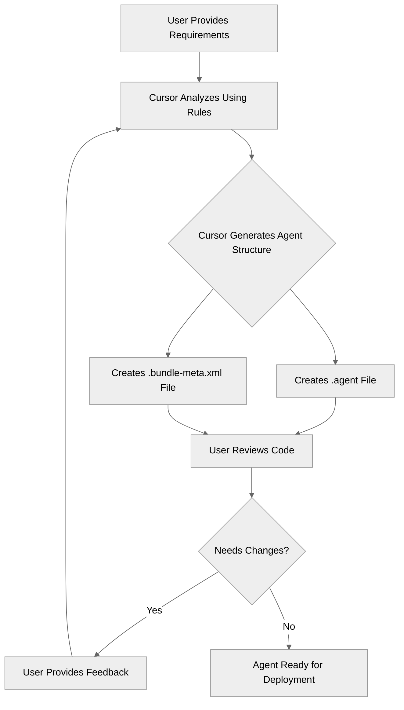
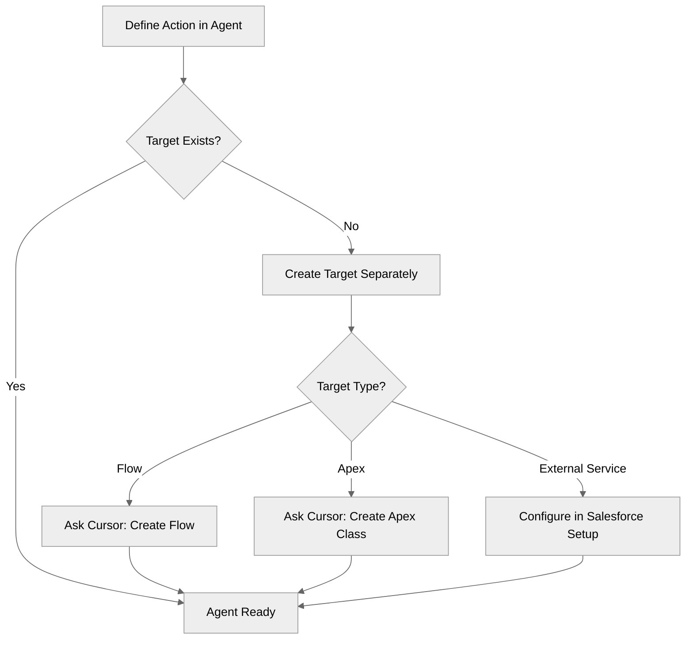

# Building Agent Script Agents with Cursor

## Overview

This documentation provides a comprehensive guide for building Salesforce Agent Script agents using Cursor IDE. It covers the process, requirements, capabilities, and limitations to help your team efficiently create conversational AI agents.

---

## 1. How Cursor Builds the Agent

### 1.1 File Structure Created

When you ask Cursor to build an agent, it creates two essential files:

1. **Agent Script File** (`.agent`)
   - Location: `force-app/main/default/aiAuthoringBundles/<AgentName>/<AgentName>.agent`
   - Contains the agent configuration, topics, actions, and reasoning logic
   - Written in Agent Script syntax (a domain-specific language for Salesforce agents)

2. **Metadata File** (`.bundle-meta.xml`)
   - Location: `force-app/main/default/aiAuthoringBundles/<AgentName>/<AgentName>.bundle-meta.xml`
   - Defines the bundle type as `AGENT`
   - Required for Salesforce deployment
   - Contains minimal metadata:
     ```xml
     <?xml version="1.0" encoding="UTF-8" ?>
     <AiAuthoringBundle xmlns="http://soap.sforce.com/2006/04/metadata">
         <bundleType>AGENT</bundleType>
         <versionTag>v0.1</versionTag>
     </AiAuthoringBundle>
     ```

### 1.2 Agent Script Structure

Cursor builds agents following a strict block ordering that must be maintained:

```agentscript
# 1. CONFIG (required) - Agent metadata
config:
   agent_name: "My_Agent"
   agent_label: "My Agent"
   description: "What the agent does"
   agent_type: "AgentforceServiceAgent"  # or "AgentforceEmployeeAgent"
   default_agent_user: "user@example.com"  # Required for ServiceAgent

# 2. VARIABLES (optional) - State management
variables:
   my_var: mutable string = ""
      description: "Description for slot-filling"
   session_id: linked string
      description: "The session ID"
      source: @session.sessionID

# 3. SYSTEM (required) - Global settings
system:
   messages:
      welcome: "Welcome message shown when conversation starts"
      error: "Error message shown when something goes wrong"
   instructions: "System-wide instructions that guide agent behavior"

# 4. START_AGENT (required) - Entry point
start_agent topic_selector:
   description: "Entry point that routes users to appropriate topics"
   reasoning:
      instructions:|
         Select the tool that best matches the user's message.
      actions:
         start: @utils.transition to @topic.main
            description: "Begin main conversation"

# 5. TOPICS (at least one required)
topic main:
   description: "What this topic handles"
   actions:
      my_action:
         description: "Action description"
         inputs:
            param: string
               description: "Parameter description"
         outputs:
            result: string
               description: "Result description"
         target: "flow://MyFlow"
   reasoning:
      instructions:->
         | Instructions for this topic
      actions:
         use_action: @actions.my_action
            with param=...
            set @variables.result = @outputs.result
```

**Critical Block Ordering Rules:**
- Blocks MUST appear in this exact order: config → variables → system → connections → knowledge → language → start_agent → topics
- Within topics: description → system → actions → before_reasoning → reasoning → after_reasoning
- Within reasoning: instructions → actions

### 1.3 How Cursor Uses Rules

Cursor follows rules defined in `.cursor/rules/` directory:

- **agent-script.mdc**: Comprehensive Agent Script syntax, patterns, and validation rules
  - Defines naming conventions (letters, numbers, underscores only)
  - Specifies block ordering requirements
  - Provides examples of common patterns
  - Includes error prevention guidelines

- **apex-rules.mdc**: Apex code standards (for creating supporting Apex classes)
  - Security requirements (USER_MODE, FLS checks)
  - Bulkification patterns
  - Testing requirements
  - Code quality standards

- **mermaid-scripts.mdc**: Diagram formatting rules for documentation
- **readme-structure.mdc**: Documentation structure standards

These rules guide Cursor to generate valid, well-structured agent code that follows Salesforce best practices.

### 1.4 The Build Process

The build process follows these steps:



**Step-by-Step Process:**

1. **User provides requirements** → You describe what the agent should do
2. **Cursor analyzes using rules** → Cursor uses `.cursor/rules/` files to understand syntax and patterns
3. **Cursor generates agent structure** → Creates `.agent` file with proper blocks in correct order
4. **Cursor creates metadata** → Generates `.bundle-meta.xml` file automatically
5. **User reviews and iterates** → You can ask Cursor to refine, add features, or fix issues
6. **Agent is ready** → Deploy to Salesforce when complete

**Example Interaction:**

```
You: Create an agent called "OrderHelper" that helps customers check order status

Cursor: [Creates OrderHelper.agent and OrderHelper.bundle-meta.xml]

You: Add a topic for returns and an action to get return status

Cursor: [Updates OrderHelper.agent with new topic and action]
```

---

## 2. What the User Needs to Provide to Cursor

### 2.1 Essential Information

To build an effective agent, you need to provide Cursor with several types of information:

#### Agent Identity

- **Agent name**: Must follow naming rules (letters, numbers, underscores only; max 80 chars; starts with letter)
- **Agent purpose/description**: What the agent does and why it exists
- **Agent type**: `AgentforceServiceAgent` (for customer-facing) or `AgentforceEmployeeAgent` (for internal use)
- **Default agent user**: Required for ServiceAgent (email address of the user account that runs the agent)

#### Conversation Design

- **Topics/conversation areas**: What distinct conversation areas does the agent need?
  - Example: `order_lookup`, `order_status`, `returns`, `shipping`
- **Entry point topic**: What is the first topic users interact with?
- **Topic transitions**: How should the agent move between topics?
- **Welcome and error messages**: What should users see when starting or encountering errors?

#### State Management

- **Variables to track**: What information needs to be remembered across the conversation?
  - User data: name, email, preferences
  - Process state: step completed, status, current task
  - Collected inputs: selections, answers, IDs
- **Variable types**: Which are mutable (agent can change) vs linked (read-only from external source)?
- **Default values**: What should mutable variables start with?

#### External Integrations

- **Actions needed**: What external systems does the agent need to call?
- **For each action**:
  - **Description**: What does this action do? (helps LLM decide when to use it)
  - **Required inputs**: What parameters does it need? (names, types, descriptions)
  - **Expected outputs**: What data does it return? (names, types, descriptions)
  - **Target system**: Flow, Apex class, Prompt Template, External API, etc.

#### Behavior & Instructions

- **System-wide instructions**: Overall personality, tone, behavior guidelines
- **Topic-specific instructions**: What should the agent do in each topic?
- **Conditional logic**: Are there conditions that change behavior?
- **Action availability**: When should actions be available? (always, conditionally, etc.)

### 2.2 Example Prompt to Cursor

Here's a complete example of what to provide:

```
Create an agent called "CustomerServiceAgent" that:
- Helps customers with order inquiries
- Agent type: AgentforceServiceAgent
- Default agent user: support@company.com
- Has topics for: order_lookup, order_status, returns
- Tracks variables: 
  - order_id (mutable string, default "")
  - customer_name (mutable string, default "")
  - order_status (mutable string, default "")
- Has actions:
  - get_order_details: calls flow://GetOrderDetails
    - Inputs: order_id (string)
    - Outputs: order_number (string), status (string), total (number)
  - update_order_status: calls apex://OrderService
    - Inputs: order_id (string), new_status (string)
    - Outputs: success (boolean), message (string)
- Welcome message: "Hello! How can I help with your order today?"
- Error message: "I'm sorry, I encountered an issue. Please try again."
- System instructions: "You are a helpful and professional customer service agent. 
  Always be polite and clear. Ask for order ID if the customer hasn't provided it."
```

### 2.3 Discovery Questions to Answer

Before building, work through these questions to ensure you have all requirements:

#### 1. Agent Identity & Purpose

- What is the agent's name? (follows naming rules)
- What is its primary purpose? (becomes the description)
- What personality should it have? (Friendly, professional, formal, casual?)
- What should the welcome message say?
- What should the error message say?

#### 2. Topics & Conversation Flow

- What distinct conversation areas (topics) does this agent need?
- What is the entry point topic? (The first topic users interact with)
- How should the agent transition between topics?
- Are there any topics that need to delegate to other topics and return?

#### 3. State Management

- What information needs to be tracked across the conversation?
  - User data (name, email, preferences)?
  - Process state (step completed, status)?
  - Collected inputs (selections, answers)?
- What external context is needed? (session ID, user record, etc.)

#### 4. Actions & External Systems

- What external systems does the agent need to call?
  - Salesforce Flows
  - Apex classes
  - Prompt templates
  - External APIs
- For each action:
  - What inputs does it need?
  - What outputs does it return?
  - When should it be available?

#### 5. Reasoning & Instructions

- What should the agent do in each topic?
- Are there conditions that change the instructions?
- Should any actions run automatically before/after reasoning?

### 2.4 Providing Information Incrementally

You don't need to provide everything at once. You can build iteratively:

**Initial Request:**
```
Create a simple agent called "OrderHelper" that helps with orders
```

**Then Add Details:**
```
Add a topic for order lookup that tracks order_id variable
```

**Then Add Actions:**
```
Add an action get_order_details that calls flow://GetOrderDetails
```

**Then Refine:**
```
Update the welcome message to be more friendly
Add error handling for when order_id is not found
```

---

## 3. What Can Be Built and What Cannot Be Built

### 3.1 What Cursor CAN Build

#### Agent Script Files

Cursor can create complete, valid Agent Script files including:

- ✅ **Complete `.agent` files** with proper structure and block ordering
- ✅ **Config blocks** with agent metadata (name, type, description)
- ✅ **Variable definitions** (mutable and linked variables with proper types)
- ✅ **System blocks** with welcome/error messages and global instructions
- ✅ **Start agent blocks** with routing logic to topics
- ✅ **Topic blocks** with descriptions, actions, and reasoning
- ✅ **Action definitions** (structure and configuration - see limitations below)
- ✅ **Reasoning instructions** with conditional logic and templates
- ✅ **Topic transitions** and delegation patterns
- ✅ **Before/after reasoning hooks** for lifecycle management

#### Action Definitions

Cursor can create action definitions that reference various target types:

**Salesforce Flows** (`target: "flow://FlowName"`)

```agentscript
actions:
   get_customer:
      description: "Fetches customer information from Salesforce"
      inputs:
         customer_id: string
            description: "The customer's unique ID"
      outputs:
         name: string
            description: "Customer's full name"
         email: string
            description: "Customer's email address"
      target: "flow://GetCustomerInfo"
```

- ✅ Defines the action structure
- ✅ Specifies inputs and outputs
- ⚠️ **Note**: The Flow itself must exist or be created separately

**Apex Classes** (`target: "apex://ClassName`)

```agentscript
actions:
   process_order:
      description: "Processes an order through the system"
      inputs:
         order_id: string
         action: string
      outputs:
         success: boolean
         message: string
      target: "apex://OrderProcessor"
```

- ✅ Defines the action structure
- ✅ Specifies inputs and outputs
- ⚠️ **Note**: The Apex class must exist or be created separately (Cursor can help create it)

**Prompt Templates** (`target: "prompt://TemplateName"`)

```agentscript
actions:
   generate_response:
      description: "Generates a personalized response using AI"
      inputs:
         context: string
      outputs:
         promptResponse: string
      target: "prompt://GeneratePersonalizedResponse"
```

- ✅ Defines the action structure
- ✅ Specifies inputs and outputs
- ⚠️ **Note**: The Prompt Template must exist in Salesforce Prompt Builder

**External APIs** (`target: "externalService://ServiceName"`)

```agentscript
actions:
   get_weather:
      description: "Retrieves weather data from external API"
      inputs:
         location: string
      outputs:
         temperature: number
         conditions: string
      target: "externalService://WeatherAPI"
```

- ✅ Defines the action structure
- ✅ Specifies inputs and outputs
- ⚠️ **Note**: The External Service must be configured in Salesforce Setup separately

**Other Supported Action Types:**

- ✅ `standardInvocableAction` - Built-in Salesforce actions
- ✅ `quickAction` - Salesforce Quick Actions
- ✅ `api` - REST API endpoints
- ✅ `apexRest` - Apex REST endpoints
- ✅ `serviceCatalog` - Service Catalog items
- ✅ `integrationProcedureAction` - Integration procedures
- ✅ `mcpTool` - MCP tools
- ✅ `retriever` - Retrieval actions

#### Supporting Code (with separate requests)

Cursor can also create supporting code when asked separately:

- ✅ **Apex classes** with `@InvocableMethod` annotations for actions
- ✅ **Apex test classes** following testing best practices
- ✅ **Salesforce Flows** (with a separate request to Cursor)
- ✅ **Flow test classes** for testing flows

**Example:**
```
You: Create an agent with an action that calls get_customer_info

Cursor: [Creates agent with action definition]

You: Now create an Apex class CustomerService with an invocable method 
     get_customer_info that takes customer_id and returns name and email

Cursor: [Creates Apex class with proper structure]
```

### 3.2 What Cursor CANNOT Build

#### External Systems

- ❌ **External APIs** - Cannot create the actual API endpoints/services
  - Can only define action references to existing APIs
  - The API must be created and configured outside of Cursor/Salesforce
  - Example: Cannot create a weather API service, but can reference one that exists

- ❌ **Third-party integrations** - Cannot create integrations with external services
  - Can define action structures that reference them
  - The integration must be configured in Salesforce Setup separately
  - Example: Cannot set up Stripe integration, but can reference it in actions

#### Salesforce Configuration

- ❌ **External Services** - Cannot configure External Service definitions in Salesforce
  - Can reference them in action targets (`externalService://ServiceName`)
  - Must be configured manually in Salesforce Setup → External Services
  - Requires: API endpoint, authentication, request/response schemas

- ❌ **Named Credentials** - Cannot create Named Credentials for API authentication
  - Can reference them in Flows/Apex code
  - Must be configured manually in Salesforce Setup → Named Credentials
  - Required for secure API authentication

- ❌ **Connected Apps** - Cannot create Connected Apps for OAuth
  - Must be configured manually in Salesforce Setup
  - Required for some external integrations

#### Complex Metadata

- ❌ **Custom Objects/Fields** - Cannot create custom objects or fields directly
  - Can reference them in agent code, Flows, and Apex
  - Must be created separately (though Cursor can help with Apex/Flows that use them)
  - Example: Cannot create `Order__c` object, but can create Flows that use it

- ❌ **Permission Sets** - Cannot create permission sets
  - Can reference them in documentation
  - Must be created manually in Salesforce Setup

- ❌ **Profiles** - Cannot create or modify profiles
  - Must be configured manually in Salesforce Setup

### 3.3 Action Target Limitations

**What Cursor Creates:**

```agentscript
actions:
   get_customer:
      description: "Fetches customer information"
      inputs:
         customer_id: string
            description: "The customer's unique ID"
      outputs:
         name: string
            description: "Customer's name"
         email: string
            description: "Customer's email"
      target: "flow://GetCustomerInfo"  # ← References existing Flow
```

**What Must Exist First:**

- The Flow `GetCustomerInfo` must exist in Salesforce, OR
- You must ask Cursor to create it separately: 
  ```
  "Create a Flow called GetCustomerInfo that takes customer_id as input 
   and returns name and email"
  ```

**Workflow:**



### 3.4 Typical Workflow

Here's the recommended workflow for building an agent with actions:

**Step 1: Define Agent Structure**
```
You: Create an agent called "OrderHelper" with an action get_order_details 
     that calls flow://GetOrderDetails
```

**Step 2: Create Supporting Flows/Apex**
```
You: Create a Flow called GetOrderDetails that takes order_id and returns 
     order details
```

**Step 3: Configure External Services** (if needed)
- Manually configure in Salesforce Setup → External Services
- Set up authentication (Named Credentials)
- Define request/response schemas

**Step 4: Deploy**
- Deploy agent file (`.agent` and `.bundle-meta.xml`)
- Deploy supporting Flows/Apex
- Test in Salesforce

### 3.5 Best Practices

#### For Actions

**Recommended Approach:**
1. ✅ Define action structure in agent first
2. ✅ Then create the referenced Flow/Apex separately
3. ✅ Or reference existing Flows/Apex that already exist

**Example:**
```
# First, define the agent with action
"Create agent OrderHelper with action get_order that calls flow://GetOrder"

# Then create the Flow
"Create Flow GetOrder that takes order_id and returns order details"
```

#### For External APIs

**Recommended Approach:**
1. ✅ Define action structure in agent
2. ✅ Configure External Service in Salesforce Setup manually
3. ✅ Create Flow/Apex that calls the External Service
4. ✅ Reference that Flow/Apex in the action target

**Example:**
```
# In agent:
target: "flow://GetWeatherData"  # Flow that calls External Service

# Flow GetWeatherData calls:
# External Service: WeatherAPI (configured in Setup)
```

#### For Complex Integrations

**Recommended Approach:**
1. ✅ Start with agent structure and action definitions
2. ✅ Create supporting Flows/Apex incrementally
3. ✅ Test each component separately
4. ✅ Integrate and test end-to-end

### 3.6 Complete Example Workflow

Here's a complete example of building an agent with external API integration:

```
# Step 1: Create agent with action definition
You: Create an agent called "WeatherAgent" with an action get_weather 
     that calls flow://GetWeatherData. The action takes location (string) 
     and returns temperature (number) and conditions (string).

Cursor: [Creates WeatherAgent.agent with action definition]

# Step 2: Configure External Service (Manual)
[In Salesforce Setup → External Services]
- Create External Service: WeatherAPI
- Configure endpoint: https://api.weather.com/v1
- Set up Named Credential for authentication
- Define request/response schemas

# Step 3: Create Flow that uses External Service
You: Create a Flow called GetWeatherData that:
     - Takes location as input (Text)
     - Calls External Service WeatherAPI
     - Returns temperature (Number) and conditions (Text)

Cursor: [Creates GetWeatherData Flow]

# Step 4: Deploy and Test
[Deploy agent and Flow to Salesforce]
[Test the agent in Salesforce]
```

---

## Summary

### Cursor Builds

- ✅ Agent Script files (`.agent`) with complete structure
- ✅ Metadata files (`.bundle-meta.xml`)
- ✅ Action definitions (structure and configuration)
- ✅ Supporting Apex classes (with separate request)
- ✅ Supporting Flows (with separate request)
- ✅ Reasoning instructions with conditional logic
- ✅ Topic structures and transitions

### Cursor Does NOT Build

- ❌ External APIs/services (the actual API endpoints)
- ❌ External Service configurations (must configure in Salesforce Setup)
- ❌ Named Credentials (must configure in Salesforce Setup)
- ❌ Custom Objects/Fields (must create separately, though Cursor can help with code that uses them)
- ❌ Permission Sets and Profiles

### User Provides

- Agent requirements (name, purpose, topics, actions)
- Business logic and instructions
- Integration requirements
- Iterative feedback for refinement

### Result

- Complete, deployable Agent Script agent
- Properly structured and validated code
- Ready for Salesforce deployment
- Follows Salesforce best practices and coding standards

---

## Quick Reference

### Action Target Types

| Target Type | Format | Can Cursor Create? | Notes |
|------------|--------|-------------------|-------|
| Salesforce Flow | `flow://FlowName` | ✅ Structure only | Flow must exist or be created separately |
| Apex Class | `apex://ClassName` | ✅ Structure only | Class must exist or be created separately |
| Prompt Template | `prompt://TemplateName` | ✅ Structure only | Template must exist in Prompt Builder |
| External Service | `externalService://ServiceName` | ✅ Structure only | Service must be configured in Setup |
| Standard Action | `standardInvocableAction://ActionName` | ✅ Structure only | Built-in Salesforce actions |
| Quick Action | `quickAction://ActionName` | ✅ Structure only | Quick Action must exist |
| REST API | `api://EndpointName` | ✅ Structure only | Endpoint must exist |
| Apex REST | `apexRest://ClassName` | ✅ Structure only | Class must exist |

### File Locations

- Agent files: `force-app/main/default/aiAuthoringBundles/<AgentName>/`
- Supporting Flows: `force-app/main/default/flows/`
- Supporting Apex: `force-app/main/default/classes/`

### Naming Rules

- Agent names: Letters, numbers, underscores only; max 80 chars; starts with letter
- Topic names: Same rules as agent names
- Variable names: Same rules as agent names
- Action names: Same rules as agent names

---

## Next Steps

1. **Start Simple**: Create a basic agent with one topic
2. **Add Complexity**: Add topics, variables, and actions incrementally
3. **Create Supporting Code**: Build Flows and Apex classes as needed
4. **Test Iteratively**: Test each component before moving to the next
5. **Deploy**: Deploy to Salesforce when ready

For more examples and patterns, see the `agent-script-recipes` directory in this repository.

